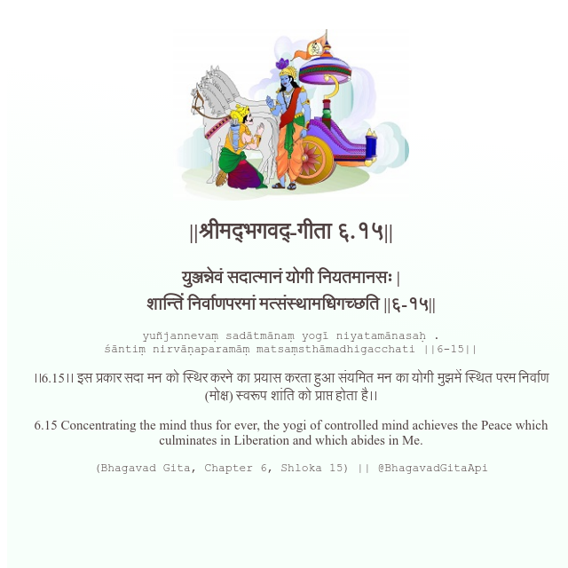

<h2>||श्रीमद्‍भगवद्‍-गीता ६.१५||</h2>
<h3>युञ्जन्नेवं सदात्मानं योगी नियतमानसः | शान्तिं निर्वाणपरमां मत्संस्थामधिगच्छति ||६-१५||</h3>
<pre>yuñjannevaṃ sadātmānaṃ yogī niyatamānasaḥ . śāntiṃ nirvāṇaparamāṃ matsaṃsthāmadhigacchati ||6-15||</pre>

।।6.15।। इस प्रकार सदा मन को स्थिर करने का प्रयास करता हुआ संयमित मन का योगी मुझमें स्थित परम निर्वाण (मोक्ष) स्वरूप शांति को प्राप्त होता है।।

<pre>(Bhagavad Gita, Chapter 6, Shloka 15) || @BhagavadGitaApi</pre>
https://docs.bhagavadgitaapi.in/

#API #bhagavadgitaapi #slok #nodejs #js #api #gitaapi #krishna #hinduism #vedic #ISKCON #shreemadbhagavadgita #technology

