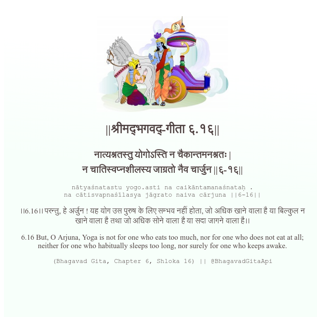

<h2>||श्रीमद्‍भगवद्‍-गीता ६.१६||</h2>
<h3>नात्यश्नतस्तु योगोऽस्ति न चैकान्तमनश्नतः | न चातिस्वप्नशीलस्य जाग्रतो नैव चार्जुन ||६-१६||</h3>
<pre>nātyaśnatastu yogo.asti na caikāntamanaśnataḥ . na cātisvapnaśīlasya jāgrato naiva cārjuna ||6-16||</pre>

।।6.16।। परन्तु, हे अर्जुन ! यह योग उस पुरुष के लिए सम्भव नहीं होता, जो अधिक खाने वाला है या बिल्कुल न खाने वाला है तथा जो अधिक सोने वाला है या सदा जागने वाला है।।

<pre>(Bhagavad Gita, Chapter 6, Shloka 16) || @BhagavadGitaApi</pre>
https://bhagavadgitaapi.in/

#API #bhagavadgitaapi #slok #nodejs #js #api #gitaapi #krishna #hinduism #vedic #ISKCON #shreemadbhagavadgita #technology

