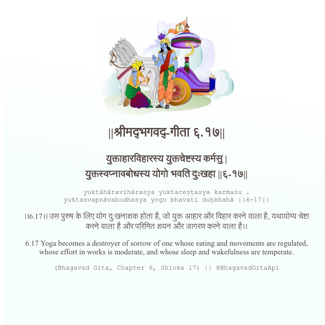

<h2>||श्रीमद्‍भगवद्‍-गीता ६.१७||</h2>
<h3>युक्ताहारविहारस्य युक्तचेष्टस्य कर्मसु | युक्तस्वप्नावबोधस्य योगो भवति दुःखहा ||६-१७||</h3>
<pre>yuktāhāravihārasya yuktaceṣṭasya karmasu . yuktasvapnāvabodhasya yogo bhavati duḥkhahā ||6-17||</pre>

।।6.17।। उस पुरुष के लिए योग दु:खनाशक होता है, जो युक्त आहार और विहार करने वाला है, यथायोग्य चेष्टा करने वाला है और परिमित शयन और जागरण करने वाला है।।

<pre>(Bhagavad Gita, Chapter 6, Shloka 17) || @BhagavadGitaApi</pre>
https://vedicscriptures.github.io/

#API #bhagavadgitaapi #slok #nodejs #js #api #gitaapi #krishna #hinduism #vedic #ISKCON #shreemadbhagavadgita #technology

