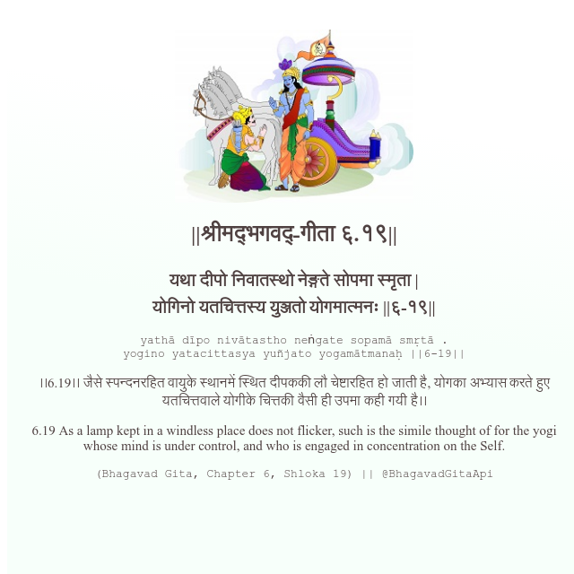

<h2>||श्रीमद्‍भगवद्‍-गीता ६.१९||</h2>
<h3>यथा दीपो निवातस्थो नेङ्गते सोपमा स्मृता | योगिनो यतचित्तस्य युञ्जतो योगमात्मनः ||६-१९||</h3>
<pre>yathā dīpo nivātastho neṅgate sopamā smṛtā . yogino yatacittasya yuñjato yogamātmanaḥ ||6-19||</pre>

।।6.19।। जैसे स्पन्दनरहित वायुके स्थानमें स्थित दीपककी लौ चेष्टारहित हो जाती है, योगका अभ्यास करते हुए यतचित्तवाले योगीके चित्तकी वैसी ही उपमा कही गयी है।।

<pre>(Bhagavad Gita, Chapter 6, Shloka 19) || @BhagavadGitaApi</pre>
https://docs.bhagavadgitaapi.in/

#API #bhagavadgitaapi #slok #nodejs #js #api #gitaapi #krishna #hinduism #vedic #ISKCON #shreemadbhagavadgita #technology

