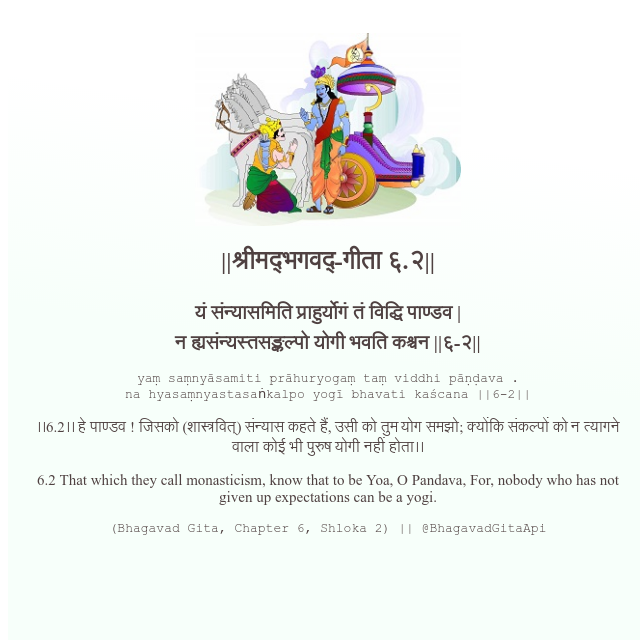

<h2>||श्रीमद्‍भगवद्‍-गीता ६.२||</h2>
<h3>यं संन्यासमिति प्राहुर्योगं तं विद्धि पाण्डव | न ह्यसंन्यस्तसङ्कल्पो योगी भवति कश्चन ||६-२||</h3>
<pre>yaṃ saṃnyāsamiti prāhuryogaṃ taṃ viddhi pāṇḍava . na hyasaṃnyastasaṅkalpo yogī bhavati kaścana ||6-2||</pre>

।।6.2।। हे पाण्डव ! जिसको (शास्त्रवित्) संन्यास कहते हैं, उसी को तुम योग समझो; क्योंकि संकल्पों को न त्यागने वाला कोई भी पुरुष योगी नहीं होता।।

<pre>(Bhagavad Gita, Chapter 6, Shloka 2) || @BhagavadGitaApi</pre>
https://docs.bhagavadgitaapi.in/

#API #bhagavadgitaapi #slok #nodejs #js #api #gitaapi #krishna #hinduism #vedic #ISKCON #shreemadbhagavadgita #technology

