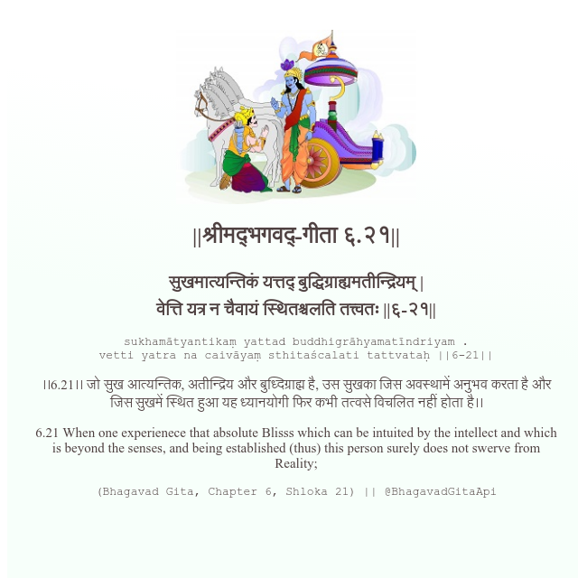

<h2>||श्रीमद्‍भगवद्‍-गीता ६.२१||</h2>
<h3>सुखमात्यन्तिकं यत्तद् बुद्धिग्राह्यमतीन्द्रियम् | वेत्ति यत्र न चैवायं स्थितश्चलति तत्त्वतः ||६-२१||</h3>
<pre>sukhamātyantikaṃ yattad buddhigrāhyamatīndriyam . vetti yatra na caivāyaṃ sthitaścalati tattvataḥ ||6-21||</pre>

।।6.21।। जो सुख आत्यन्तिक, अतीन्द्रिय और बुध्दिग्राह्म है, उस सुखका जिस अवस्थामें अनुभव करता है और जिस सुखमें स्थित हुआ यह ध्यानयोगी फिर कभी तत्वसे विचलित नहीं होता है।।

<pre>(Bhagavad Gita, Chapter 6, Shloka 21) || @BhagavadGitaApi</pre>
https://bhagavadgitaapi.in/

#API #bhagavadgitaapi #slok #nodejs #js #api #gitaapi #krishna #hinduism #vedic #ISKCON #shreemadbhagavadgita #technology

