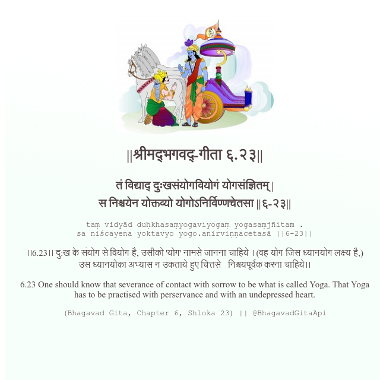

<h2>||श्रीमद्‍भगवद्‍-गीता ६.२३||</h2>
<h3>तं विद्याद् दुःखसंयोगवियोगं योगसंज्ञितम् | स निश्चयेन योक्तव्यो योगोऽनिर्विण्णचेतसा ||६-२३||</h3>
<pre>taṃ vidyād duḥkhasaṃyogaviyogaṃ yogasaṃjñitam . sa niścayena yoktavyo yogo.anirviṇṇacetasā ||6-23||</pre>

।।6.23।। दु:ख के संयोग से वियोग है, उसीको 'योग' नामसे जानना चाहिये । (वह योग जिस ध्यानयोग लक्ष्य है,) उस ध्यानयोका अभ्यास न उकताये हुए चित्तसे   निश्चयपूर्वक करना चाहिये।।

<pre>(Bhagavad Gita, Chapter 6, Shloka 23) || @BhagavadGitaApi</pre>
https://vedicscriptures.github.io/

#API #bhagavadgitaapi #slok #nodejs #js #api #gitaapi #krishna #hinduism #vedic #ISKCON #shreemadbhagavadgita #technology

