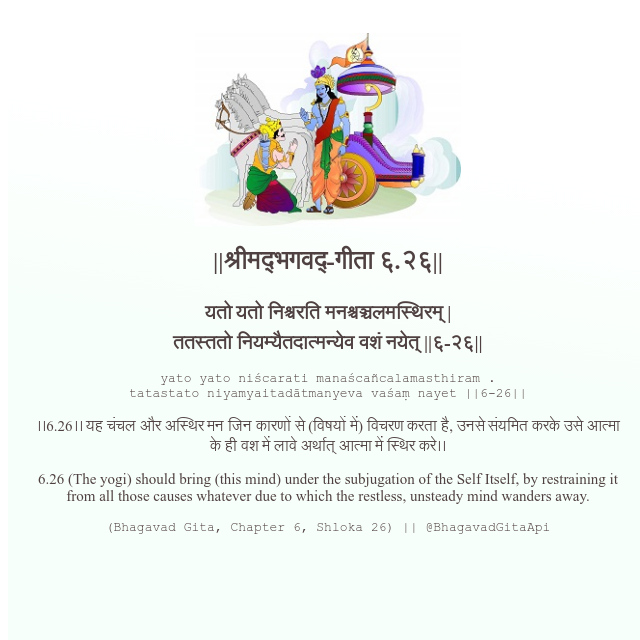

<h2>||श्रीमद्‍भगवद्‍-गीता ६.२६||</h2>
<h3>यतो यतो निश्चरति मनश्चञ्चलमस्थिरम् | ततस्ततो नियम्यैतदात्मन्येव वशं नयेत् ||६-२६||</h3>
<pre>yato yato niścarati manaścañcalamasthiram . tatastato niyamyaitadātmanyeva vaśaṃ nayet ||6-26||</pre>

।।6.26।। यह चंचल और अस्थिर मन जिन कारणों से (विषयों में) विचरण करता है, उनसे संयमित करके उसे आत्मा के ही वश में लावे अर्थात् आत्मा में स्थिर करे।।

<pre>(Bhagavad Gita, Chapter 6, Shloka 26) || @BhagavadGitaApi</pre>
https://vedicscriptures.github.io/

#API #bhagavadgitaapi #slok #nodejs #js #api #gitaapi #krishna #hinduism #vedic #ISKCON #shreemadbhagavadgita #technology

