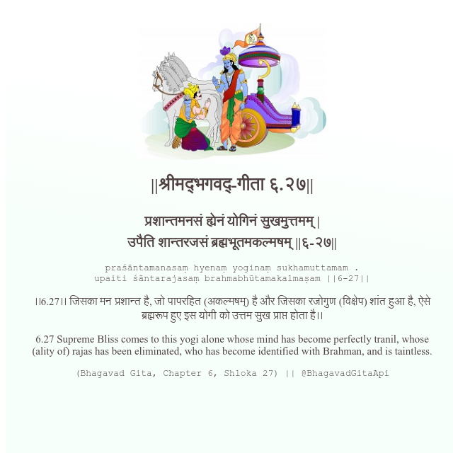

<h2>||श्रीमद्‍भगवद्‍-गीता ६.२७||</h2>
<h3>प्रशान्तमनसं ह्येनं योगिनं सुखमुत्तमम् | उपैति शान्तरजसं ब्रह्मभूतमकल्मषम् ||६-२७||</h3>
<pre>praśāntamanasaṃ hyenaṃ yoginaṃ sukhamuttamam . upaiti śāntarajasaṃ brahmabhūtamakalmaṣam ||6-27||</pre>

।।6.27।। जिसका मन प्रशान्त है, जो पापरहित (अकल्मषम्) है और जिसका रजोगुण (विक्षेप) शांत हुआ है, ऐसे ब्रह्मरूप हुए इस योगी को उत्तम सुख प्राप्त होता है।।

<pre>(Bhagavad Gita, Chapter 6, Shloka 27) || @BhagavadGitaApi</pre>
https://vedicscriptures.github.io/

#API #bhagavadgitaapi #slok #nodejs #js #api #gitaapi #krishna #hinduism #vedic #ISKCON #shreemadbhagavadgita #technology

