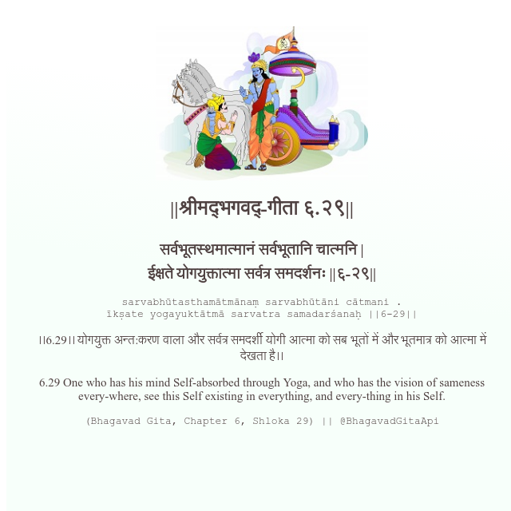

<h2>||श्रीमद्‍भगवद्‍-गीता ६.२९||</h2>
<h3>सर्वभूतस्थमात्मानं सर्वभूतानि चात्मनि | ईक्षते योगयुक्तात्मा सर्वत्र समदर्शनः ||६-२९||</h3>
<pre>sarvabhūtasthamātmānaṃ sarvabhūtāni cātmani . īkṣate yogayuktātmā sarvatra samadarśanaḥ ||6-29||</pre>

।।6.29।। योगयुक्त अन्त:करण वाला और सर्वत्र समदर्शी योगी आत्मा को सब भूतों में और भूतमात्र को आत्मा में देखता है।।

<pre>(Bhagavad Gita, Chapter 6, Shloka 29) || @BhagavadGitaApi</pre>
https://docs.bhagavadgitaapi.in/

#API #bhagavadgitaapi #slok #nodejs #js #api #gitaapi #krishna #hinduism #vedic #ISKCON #shreemadbhagavadgita #technology

