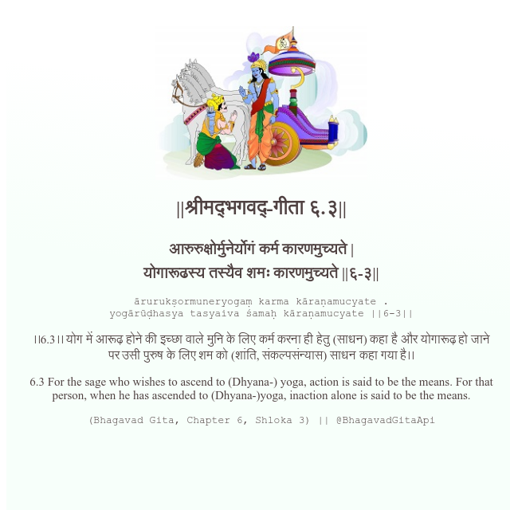

<h2>||श्रीमद्‍भगवद्‍-गीता ६.३||</h2>
<h3>आरुरुक्षोर्मुनेर्योगं कर्म कारणमुच्यते | योगारूढस्य तस्यैव शमः कारणमुच्यते ||६-३||</h3>
<pre>ārurukṣormuneryogaṃ karma kāraṇamucyate . yogārūḍhasya tasyaiva śamaḥ kāraṇamucyate ||6-3||</pre>

।।6.3।। योग में आरूढ़ होने की इच्छा वाले मुनि के लिए कर्म करना ही हेतु (साधन) कहा है और योगारूढ़ हो जाने पर उसी पुरुष के लिए शम को (शांति, संकल्पसंन्यास) साधन कहा गया है।।

<pre>(Bhagavad Gita, Chapter 6, Shloka 3) || @BhagavadGitaApi</pre>
https://docs.bhagavadgitaapi.in/

#API #bhagavadgitaapi #slok #nodejs #js #api #gitaapi #krishna #hinduism #vedic #ISKCON #shreemadbhagavadgita #technology

