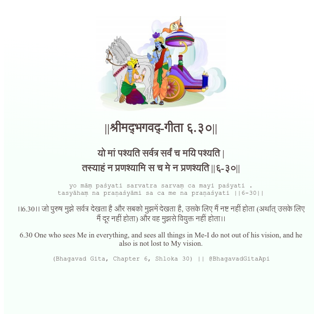

<h2>||श्रीमद्‍भगवद्‍-गीता ६.३०||</h2>
<h3>यो मां पश्यति सर्वत्र सर्वं च मयि पश्यति | तस्याहं न प्रणश्यामि स च मे न प्रणश्यति ||६-३०||</h3>
<pre>yo māṃ paśyati sarvatra sarvaṃ ca mayi paśyati . tasyāhaṃ na praṇaśyāmi sa ca me na praṇaśyati ||6-30||</pre>

।।6.30।। जो पुरुष मुझे सर्वत्र देखता है और सबको मुझमें देखता है, उसके लिए मैं नष्ट नहीं होता (अर्थात् उसके लिए मैं दूर नहीं होता) और वह मुझसे वियुक्त नहीं होता।।

<pre>(Bhagavad Gita, Chapter 6, Shloka 30) || @BhagavadGitaApi</pre>
https://docs.bhagavadgitaapi.in/

#API #bhagavadgitaapi #slok #nodejs #js #api #gitaapi #krishna #hinduism #vedic #ISKCON #shreemadbhagavadgita #technology

