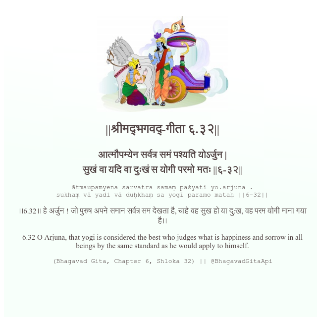

<h2>||श्रीमद्‍भगवद्‍-गीता ६.३२||</h2>
<h3>आत्मौपम्येन सर्वत्र समं पश्यति योऽर्जुन | सुखं वा यदि वा दुःखं स योगी परमो मतः ||६-३२||</h3>
<pre>ātmaupamyena sarvatra samaṃ paśyati yo.arjuna . sukhaṃ vā yadi vā duḥkhaṃ sa yogī paramo mataḥ ||6-32||</pre>

।।6.32।। हे अर्जुन ! जो पुरुष अपने समान सर्वत्र सम देखता है, चाहे वह सुख हो या दु:ख, वह परम योगी माना गया है।।

<pre>(Bhagavad Gita, Chapter 6, Shloka 32) || @BhagavadGitaApi</pre>
https://vedicscriptures.github.io/

#API #bhagavadgitaapi #slok #nodejs #js #api #gitaapi #krishna #hinduism #vedic #ISKCON #shreemadbhagavadgita #technology

