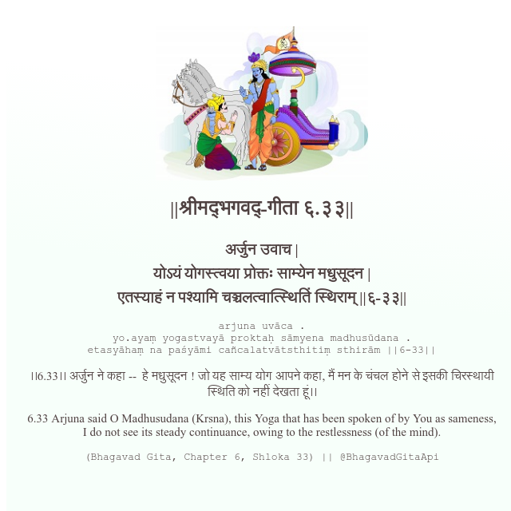

<h2>||श्रीमद्‍भगवद्‍-गीता ६.३३||</h2>
<h3>अर्जुन उवाच | योऽयं योगस्त्वया प्रोक्तः साम्येन मधुसूदन | एतस्याहं न पश्यामि चञ्चलत्वात्स्थितिं स्थिराम् ||६-३३||</h3>
<pre>arjuna uvāca . yo.ayaṃ yogastvayā proktaḥ sāmyena madhusūdana . etasyāhaṃ na paśyāmi cañcalatvātsthitiṃ sthirām ||6-33||</pre>

।।6.33।। अर्जुन ने कहा --  हे मधुसूदन ! जो यह साम्य योग आपने कहा, मैं मन के चंचल होने से इसकी चिरस्थायी स्थिति को नहीं देखता हूं।।

<pre>(Bhagavad Gita, Chapter 6, Shloka 33) || @BhagavadGitaApi</pre>
https://bhagavadgitaapi.in/

#API #bhagavadgitaapi #slok #nodejs #js #api #gitaapi #krishna #hinduism #vedic #ISKCON #shreemadbhagavadgita #technology

