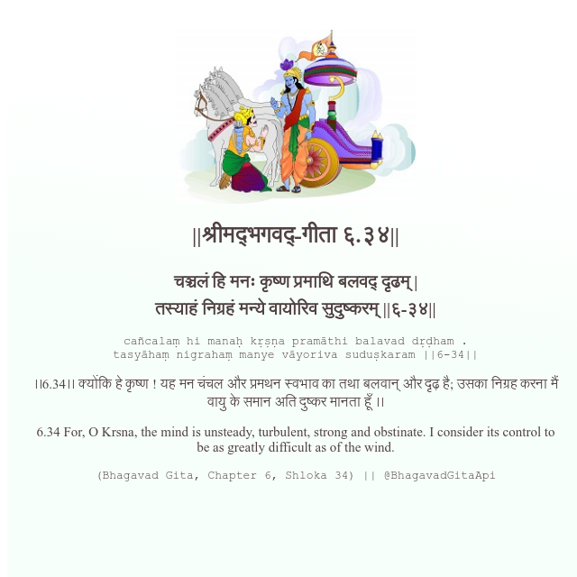

<h2>||श्रीमद्‍भगवद्‍-गीता ६.३४||</h2>
<h3>चञ्चलं हि मनः कृष्ण प्रमाथि बलवद् दृढम् | तस्याहं निग्रहं मन्ये वायोरिव सुदुष्करम् ||६-३४||</h3>
<pre>cañcalaṃ hi manaḥ kṛṣṇa pramāthi balavad dṛḍham . tasyāhaṃ nigrahaṃ manye vāyoriva suduṣkaram ||6-34||</pre>

।।6.34।। क्योंकि हे कृष्ण ! यह मन चंचल और प्रमथन स्वभाव का तथा बलवान् और दृढ़ है; उसका निग्रह करना मैं वायु के समान अति दुष्कर मानता हूँ ।।

<pre>(Bhagavad Gita, Chapter 6, Shloka 34) || @BhagavadGitaApi</pre>
https://bhagavadgitaapi.in/

#API #bhagavadgitaapi #slok #nodejs #js #api #gitaapi #krishna #hinduism #vedic #ISKCON #shreemadbhagavadgita #technology

