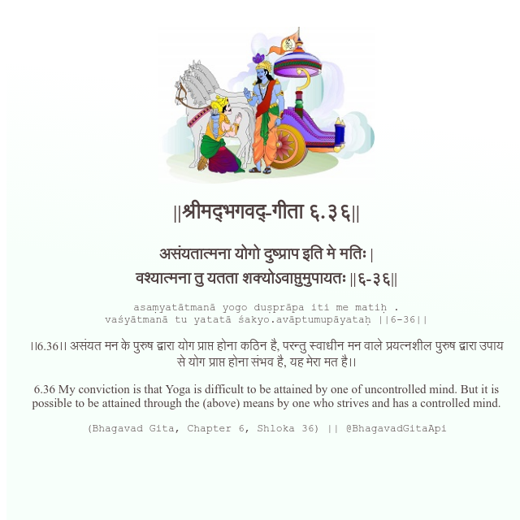

<h2>||श्रीमद्‍भगवद्‍-गीता ६.३६||</h2>
<h3>असंयतात्मना योगो दुष्प्राप इति मे मतिः | वश्यात्मना तु यतता शक्योऽवाप्तुमुपायतः ||६-३६||</h3>
<pre>asaṃyatātmanā yogo duṣprāpa iti me matiḥ . vaśyātmanā tu yatatā śakyo.avāptumupāyataḥ ||6-36||</pre>

।।6.36।। असंयत मन के पुरुष द्वारा योग प्राप्त होना कठिन है, परन्तु स्वाधीन मन वाले प्रयत्नशील पुरुष द्वारा उपाय से योग प्राप्त होना संभव है, यह मेरा मत है।।

<pre>(Bhagavad Gita, Chapter 6, Shloka 36) || @BhagavadGitaApi</pre>
https://docs.bhagavadgitaapi.in/

#API #bhagavadgitaapi #slok #nodejs #js #api #gitaapi #krishna #hinduism #vedic #ISKCON #shreemadbhagavadgita #technology

