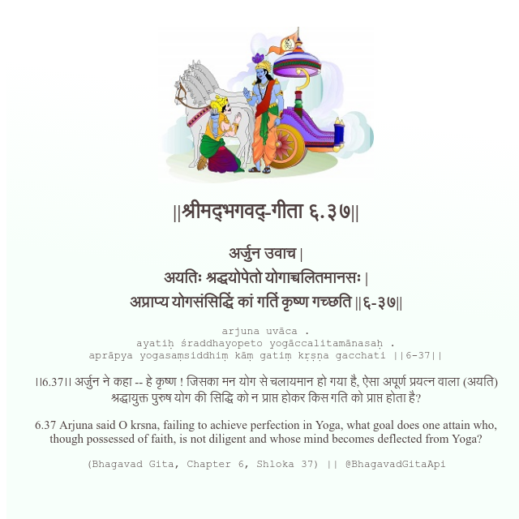

<h2>||श्रीमद्‍भगवद्‍-गीता ६.३७||</h2>
<h3>अर्जुन उवाच | अयतिः श्रद्धयोपेतो योगाच्चलितमानसः | अप्राप्य योगसंसिद्धिं कां गतिं कृष्ण गच्छति ||६-३७||</h3>
<pre>arjuna uvāca . ayatiḥ śraddhayopeto yogāccalitamānasaḥ . aprāpya yogasaṃsiddhiṃ kāṃ gatiṃ kṛṣṇa gacchati ||6-37||</pre>

।।6.37।। अर्जुन ने कहा -- हे कृष्ण ! जिसका मन योग से चलायमान हो गया है, ऐसा अपूर्ण प्रयत्न वाला (अयति) श्रद्धायुक्त पुरुष योग की सिद्धि को न प्राप्त होकर किस गति को प्राप्त होता है?

<pre>(Bhagavad Gita, Chapter 6, Shloka 37) || @BhagavadGitaApi</pre>
https://docs.bhagavadgitaapi.in/

#API #bhagavadgitaapi #slok #nodejs #js #api #gitaapi #krishna #hinduism #vedic #ISKCON #shreemadbhagavadgita #technology

