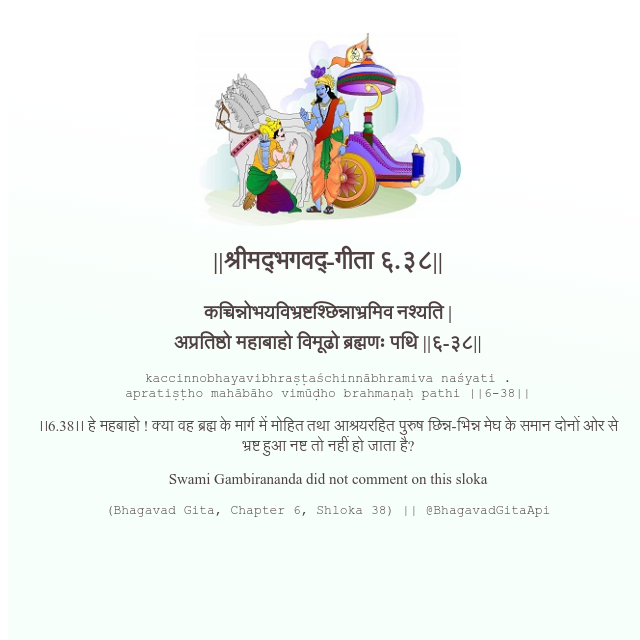

<h2>||श्रीमद्‍भगवद्‍-गीता ६.३८||</h2>
<h3>कच्चिन्नोभयविभ्रष्टश्छिन्नाभ्रमिव नश्यति | अप्रतिष्ठो महाबाहो विमूढो ब्रह्मणः पथि ||६-३८||</h3>
<pre>kaccinnobhayavibhraṣṭaśchinnābhramiva naśyati . apratiṣṭho mahābāho vimūḍho brahmaṇaḥ pathi ||6-38||</pre>

।।6.38।। हे महबाहो ! क्या वह ब्रह्म के मार्ग में मोहित तथा आश्रयरहित पुरुष छिन्न-भिन्न मेघ के समान दोनों ओर से भ्रष्ट हुआ नष्ट तो नहीं हो जाता है?

<pre>(Bhagavad Gita, Chapter 6, Shloka 38) || @BhagavadGitaApi</pre>
https://bhagavadgitaapi.in/

#API #bhagavadgitaapi #slok #nodejs #js #api #gitaapi #krishna #hinduism #vedic #ISKCON #shreemadbhagavadgita #technology

