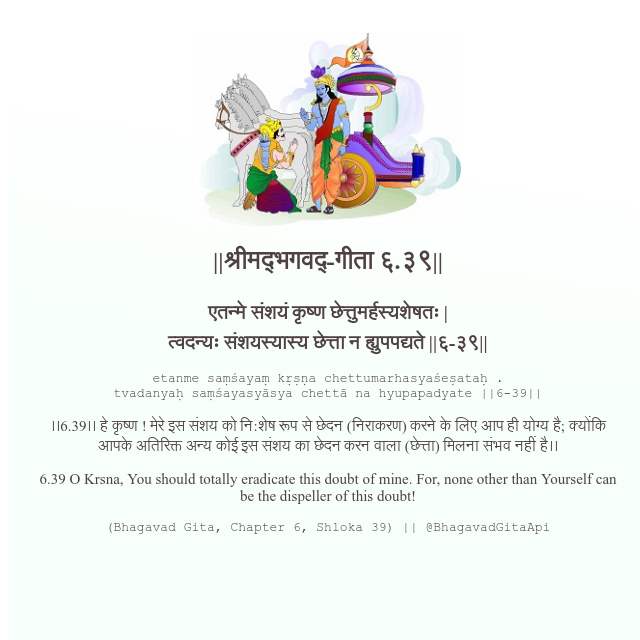

<h2>||श्रीमद्‍भगवद्‍-गीता ६.३९||</h2>
<h3>एतन्मे संशयं कृष्ण छेत्तुमर्हस्यशेषतः | त्वदन्यः संशयस्यास्य छेत्ता न ह्युपपद्यते ||६-३९||</h3>
<pre>etanme saṃśayaṃ kṛṣṇa chettumarhasyaśeṣataḥ . tvadanyaḥ saṃśayasyāsya chettā na hyupapadyate ||6-39||</pre>

।।6.39।। हे कृष्ण ! मेरे इस संशय को नि:शेष रूप से छेदन (निराकरण) करने के लिए आप ही योग्य है; क्योंकि आपके अतिरिक्त अन्य कोई इस संशय का छेदन करन वाला (छेत्ता) मिलना संभव नहीं है।।

<pre>(Bhagavad Gita, Chapter 6, Shloka 39) || @BhagavadGitaApi</pre>
https://vedicscriptures.github.io/

#API #bhagavadgitaapi #slok #nodejs #js #api #gitaapi #krishna #hinduism #vedic #ISKCON #shreemadbhagavadgita #technology

