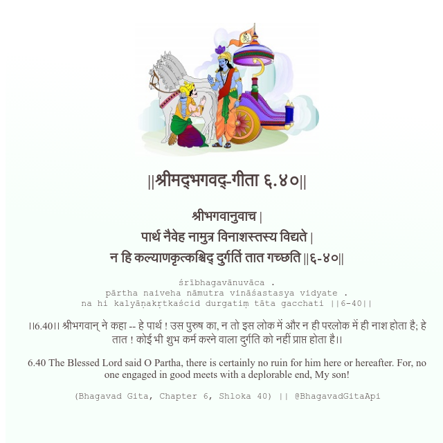

<h2>||श्रीमद्‍भगवद्‍-गीता ६.४०||</h2>
<h3>श्रीभगवानुवाच | पार्थ नैवेह नामुत्र विनाशस्तस्य विद्यते | न हि कल्याणकृत्कश्चिद् दुर्गतिं तात गच्छति ||६-४०||</h3>
<pre>śrībhagavānuvāca . pārtha naiveha nāmutra vināśastasya vidyate . na hi kalyāṇakṛtkaścid durgatiṃ tāta gacchati ||6-40||</pre>

।।6.40।। श्रीभगवान् ने कहा -- हे पार्थ ! उस पुरुष का, न तो इस लोक में और न ही परलोक में ही नाश होता है; हे तात ! कोई भी शुभ कर्म करने वाला दुर्गति को नहीं प्राप्त होता है।।

<pre>(Bhagavad Gita, Chapter 6, Shloka 40) || @BhagavadGitaApi</pre>
https://vedicscriptures.github.io/

#API #bhagavadgitaapi #slok #nodejs #js #api #gitaapi #krishna #hinduism #vedic #ISKCON #shreemadbhagavadgita #technology

