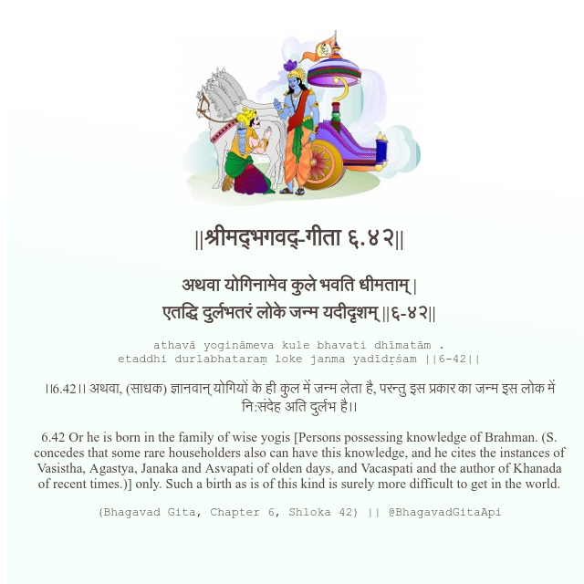

<h2>||श्रीमद्‍भगवद्‍-गीता ६.४२||</h2>
<h3>अथवा योगिनामेव कुले भवति धीमताम् | एतद्धि दुर्लभतरं लोके जन्म यदीदृशम् ||६-४२||</h3>
<pre>athavā yogināmeva kule bhavati dhīmatām . etaddhi durlabhataraṃ loke janma yadīdṛśam ||6-42||</pre>

।।6.42।। अथवा, (साधक) ज्ञानवान् योगियों के ही कुल में जन्म लेता है, परन्तु इस प्रकार का जन्म इस लोक में नि:संदेह अति दुर्लभ है।।

<pre>(Bhagavad Gita, Chapter 6, Shloka 42) || @BhagavadGitaApi</pre>
https://vedicscriptures.github.io/

#API #bhagavadgitaapi #slok #nodejs #js #api #gitaapi #krishna #hinduism #vedic #ISKCON #shreemadbhagavadgita #technology

