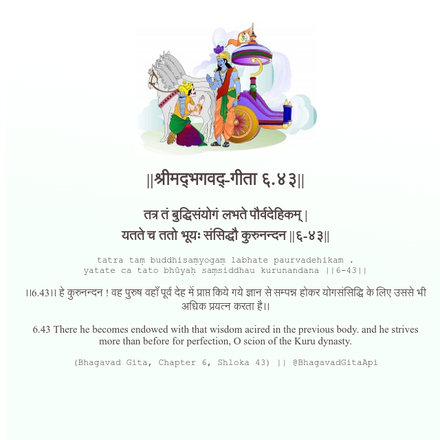

<h2>||श्रीमद्‍भगवद्‍-गीता ६.४३||</h2>
<h3>तत्र तं बुद्धिसंयोगं लभते पौर्वदेहिकम् | यतते च ततो भूयः संसिद्धौ कुरुनन्दन ||६-४३||</h3>
<pre>tatra taṃ buddhisaṃyogaṃ labhate paurvadehikam . yatate ca tato bhūyaḥ saṃsiddhau kurunandana ||6-43||</pre>

।।6.43।। हे कुरुनन्दन ! वह पुरुष वहाँ पूर्व देह में प्राप्त किये गये ज्ञान से सम्पन्न होकर योगसंसिद्धि के लिए उससे भी अधिक प्रयत्न करता है।।

<pre>(Bhagavad Gita, Chapter 6, Shloka 43) || @BhagavadGitaApi</pre>
https://vedicscriptures.github.io/

#API #bhagavadgitaapi #slok #nodejs #js #api #gitaapi #krishna #hinduism #vedic #ISKCON #shreemadbhagavadgita #technology

