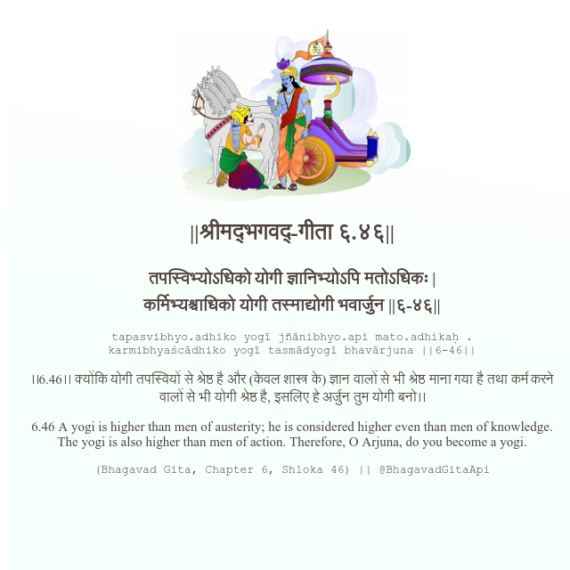

<h2>||श्रीमद्‍भगवद्‍-गीता ६.४६||</h2>
<h3>तपस्विभ्योऽधिको योगी ज्ञानिभ्योऽपि मतोऽधिकः | कर्मिभ्यश्चाधिको योगी तस्माद्योगी भवार्जुन ||६-४६||</h3>
<pre>tapasvibhyo.adhiko yogī jñānibhyo.api mato.adhikaḥ . karmibhyaścādhiko yogī tasmādyogī bhavārjuna ||6-46||</pre>

।।6.46।। क्योंकि योगी तपस्वियों से श्रेष्ठ है और (केवल शास्त्र के) ज्ञान वालों से भी श्रेष्ठ माना गया है तथा कर्म करने वालों से भी योगी श्रेष्ठ है, इसलिए हे अर्जुन तुम योगी बनो।।

<pre>(Bhagavad Gita, Chapter 6, Shloka 46) || @BhagavadGitaApi</pre>
https://bhagavadgitaapi.in/

#API #bhagavadgitaapi #slok #nodejs #js #api #gitaapi #krishna #hinduism #vedic #ISKCON #shreemadbhagavadgita #technology

