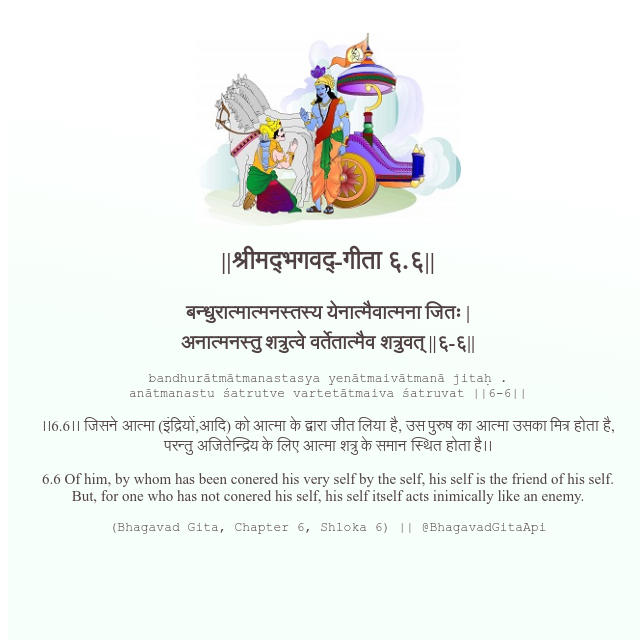

<h2>||श्रीमद्‍भगवद्‍-गीता ६.६||</h2>
<h3>बन्धुरात्मात्मनस्तस्य येनात्मैवात्मना जितः | अनात्मनस्तु शत्रुत्वे वर्तेतात्मैव शत्रुवत् ||६-६||</h3>
<pre>bandhurātmātmanastasya yenātmaivātmanā jitaḥ . anātmanastu śatrutve vartetātmaiva śatruvat ||6-6||</pre>

।।6.6।। जिसने आत्मा (इंद्रियों,आदि) को आत्मा के द्वारा जीत लिया है, उस पुरुष का आत्मा उसका मित्र होता है, परन्तु अजितेन्द्रिय के लिए आत्मा शत्रु के समान स्थित होता है।।

<pre>(Bhagavad Gita, Chapter 6, Shloka 6) || @BhagavadGitaApi</pre>
https://vedicscriptures.github.io/

#API #bhagavadgitaapi #slok #nodejs #js #api #gitaapi #krishna #hinduism #vedic #ISKCON #shreemadbhagavadgita #technology

