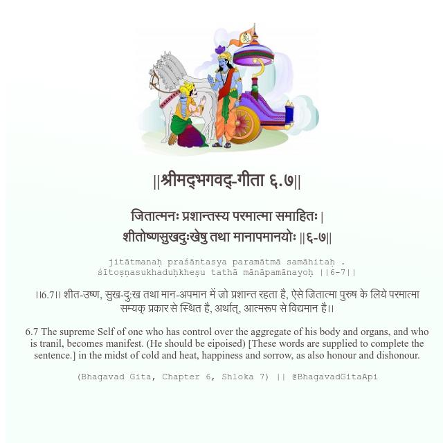

<h2>||श्रीमद्‍भगवद्‍-गीता ६.७||</h2>
<h3>जितात्मनः प्रशान्तस्य परमात्मा समाहितः | शीतोष्णसुखदुःखेषु तथा मानापमानयोः ||६-७||</h3>
<pre>jitātmanaḥ praśāntasya paramātmā samāhitaḥ . śītoṣṇasukhaduḥkheṣu tathā mānāpamānayoḥ ||6-7||</pre>

।।6.7।। शीत-उष्ण, सुख-दु:ख तथा मान-अपमान में जो प्रशान्त रहता है, ऐसे जितात्मा पुरुष के लिये परमात्मा सम्यक् प्रकार से स्थित है, अर्थात्, आत्मरूप से विद्यमान है।।

<pre>(Bhagavad Gita, Chapter 6, Shloka 7) || @BhagavadGitaApi</pre>
https://bhagavadgitaapi.in/

#API #bhagavadgitaapi #slok #nodejs #js #api #gitaapi #krishna #hinduism #vedic #ISKCON #shreemadbhagavadgita #technology

