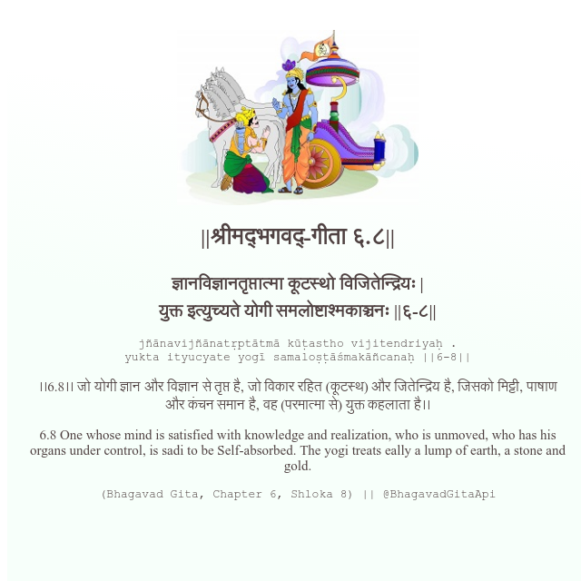

<h2>||श्रीमद्‍भगवद्‍-गीता ६.८||</h2>
<h3>ज्ञानविज्ञानतृप्तात्मा कूटस्थो विजितेन्द्रियः | युक्त इत्युच्यते योगी समलोष्टाश्मकाञ्चनः ||६-८||</h3>
<pre>jñānavijñānatṛptātmā kūṭastho vijitendriyaḥ . yukta ityucyate yogī samaloṣṭāśmakāñcanaḥ ||6-8||</pre>

।।6.8।। जो योगी ज्ञान और विज्ञान से तृप्त है, जो विकार रहित (कूटस्थ) और जितेन्द्रिय है, जिसको मिट्टी, पाषाण और कंचन समान है, वह (परमात्मा से) युक्त कहलाता है।।

<pre>(Bhagavad Gita, Chapter 6, Shloka 8) || @BhagavadGitaApi</pre>
https://bhagavadgitaapi.in/

#API #bhagavadgitaapi #slok #nodejs #js #api #gitaapi #krishna #hinduism #vedic #ISKCON #shreemadbhagavadgita #technology

