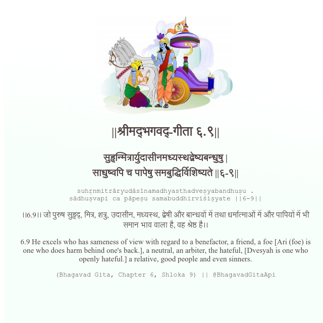

<h2>||श्रीमद्‍भगवद्‍-गीता ६.९||</h2>
<h3>सुहृन्मित्रार्युदासीनमध्यस्थद्वेष्यबन्धुषु | साधुष्वपि च पापेषु समबुद्धिर्विशिष्यते ||६-९||</h3>
<pre>suhṛnmitrāryudāsīnamadhyasthadveṣyabandhuṣu . sādhuṣvapi ca pāpeṣu samabuddhirviśiṣyate ||6-9||</pre>

।।6.9।। जो पुरुष सुहृद्, मित्र, शत्रु, उदासीन, मध्यस्थ, द्वेषी और बान्धवों में तथा धर्मात्माओं में और पापियों में भी समान भाव वाला है, वह श्रेष्ठ है।।

<pre>(Bhagavad Gita, Chapter 6, Shloka 9) || @BhagavadGitaApi</pre>
https://bhagavadgitaapi.in/

#API #bhagavadgitaapi #slok #nodejs #js #api #gitaapi #krishna #hinduism #vedic #ISKCON #shreemadbhagavadgita #technology

