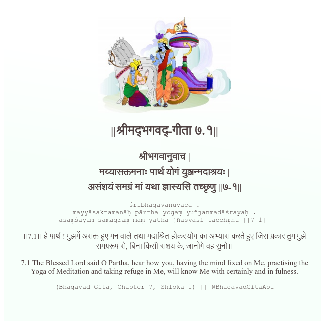

<h2>||श्रीमद्‍भगवद्‍-गीता ७.१||</h2>
<h3>श्रीभगवानुवाच | मय्यासक्तमनाः पार्थ योगं युञ्जन्मदाश्रयः | असंशयं समग्रं मां यथा ज्ञास्यसि तच्छृणु ||७-१||</h3>
<pre>śrībhagavānuvāca . mayyāsaktamanāḥ pārtha yogaṃ yuñjanmadāśrayaḥ . asaṃśayaṃ samagraṃ māṃ yathā jñāsyasi tacchṛṇu ||7-1||</pre>

।।7.1।। हे पार्थ ! मुझमें असक्त हुए मन वाले तथा मदाश्रित होकर योग का अभ्यास करते हुए जिस प्रकार तुम मुझे समग्ररूप से, बिना किसी संशय के, जानोगे वह सुनो।।

<pre>(Bhagavad Gita, Chapter 7, Shloka 1) || @BhagavadGitaApi</pre>
https://docs.bhagavadgitaapi.in/

#API #bhagavadgitaapi #slok #nodejs #js #api #gitaapi #krishna #hinduism #vedic #ISKCON #shreemadbhagavadgita #technology

