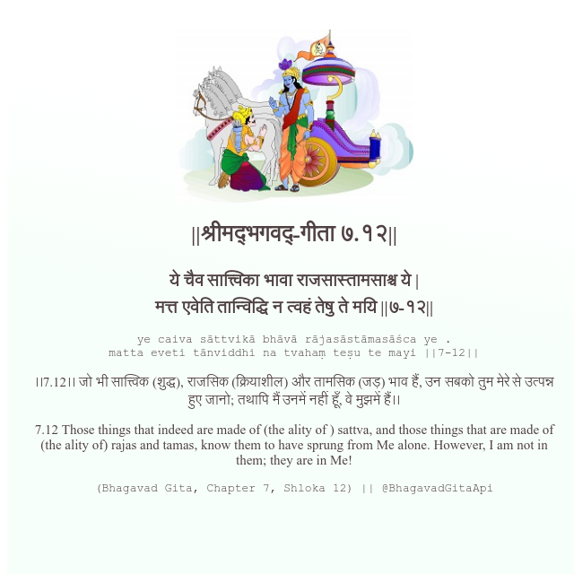

<h2>||श्रीमद्‍भगवद्‍-गीता ७.१२||</h2>
<h3>ये चैव सात्त्विका भावा राजसास्तामसाश्च ये | मत्त एवेति तान्विद्धि न त्वहं तेषु ते मयि ||७-१२||</h3>
<pre>ye caiva sāttvikā bhāvā rājasāstāmasāśca ye . matta eveti tānviddhi na tvahaṃ teṣu te mayi ||7-12||</pre>

।।7.12।। जो भी सात्त्विक (शुद्ध), राजसिक (क्रियाशील) और तामसिक (जड़) भाव हैं, उन सबको तुम मेरे से उत्पन्न हुए जानो; तथापि मैं उनमें नहीं हूँ, वे मुझमें हैं।।

<pre>(Bhagavad Gita, Chapter 7, Shloka 12) || @BhagavadGitaApi</pre>
https://bhagavadgitaapi.in/

#API #bhagavadgitaapi #slok #nodejs #js #api #gitaapi #krishna #hinduism #vedic #ISKCON #shreemadbhagavadgita #technology

