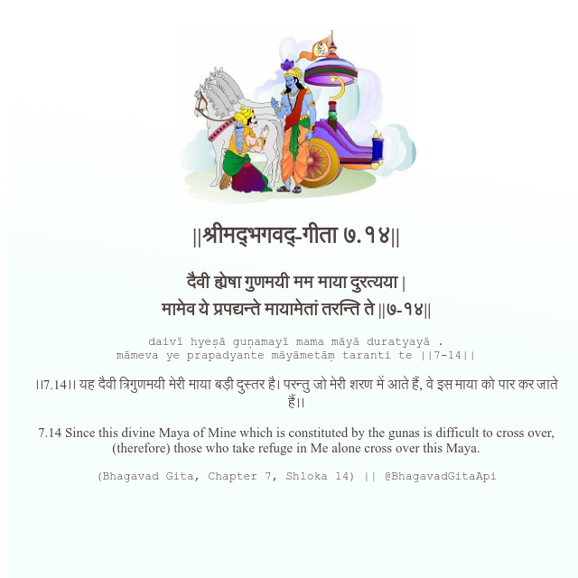

<h2>||श्रीमद्‍भगवद्‍-गीता ७.१४||</h2>
<h3>दैवी ह्येषा गुणमयी मम माया दुरत्यया | मामेव ये प्रपद्यन्ते मायामेतां तरन्ति ते ||७-१४||</h3>
<pre>daivī hyeṣā guṇamayī mama māyā duratyayā . māmeva ye prapadyante māyāmetāṃ taranti te ||7-14||</pre>

।।7.14।। यह दैवी त्रिगुणमयी मेरी माया बड़ी दुस्तर है। परन्तु जो मेरी शरण में आते हैं, वे इस माया को पार कर जाते हैं।।

<pre>(Bhagavad Gita, Chapter 7, Shloka 14) || @BhagavadGitaApi</pre>
https://docs.bhagavadgitaapi.in/

#API #bhagavadgitaapi #slok #nodejs #js #api #gitaapi #krishna #hinduism #vedic #ISKCON #shreemadbhagavadgita #technology

