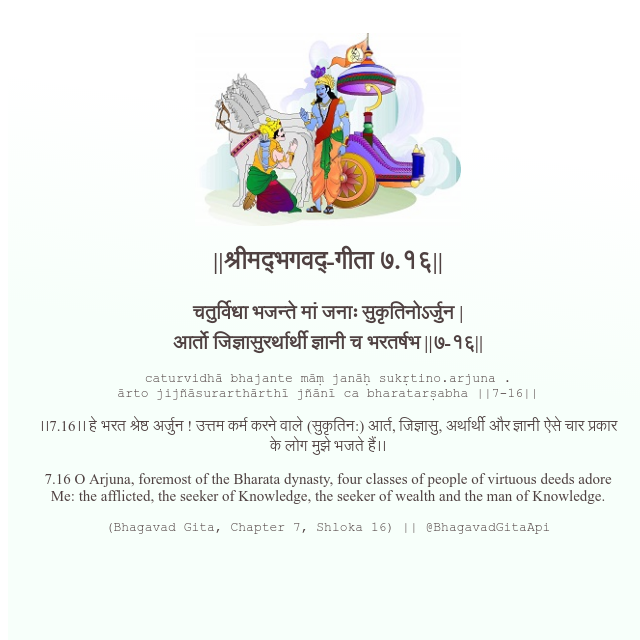

<h2>||श्रीमद्‍भगवद्‍-गीता ७.१६||</h2>
<h3>चतुर्विधा भजन्ते मां जनाः सुकृतिनोऽर्जुन | आर्तो जिज्ञासुरर्थार्थी ज्ञानी च भरतर्षभ ||७-१६||</h3>
<pre>caturvidhā bhajante māṃ janāḥ sukṛtino.arjuna . ārto jijñāsurarthārthī jñānī ca bharatarṣabha ||7-16||</pre>

।।7.16।। हे भरत श्रेष्ठ अर्जुन ! उत्तम कर्म करने वाले (सुकृतिन:) आर्त, जिज्ञासु, अर्थार्थी और ज्ञानी ऐसे चार प्रकार के लोग मुझे भजते हैं।।

<pre>(Bhagavad Gita, Chapter 7, Shloka 16) || @BhagavadGitaApi</pre>
https://bhagavadgitaapi.in/

#API #bhagavadgitaapi #slok #nodejs #js #api #gitaapi #krishna #hinduism #vedic #ISKCON #shreemadbhagavadgita #technology

