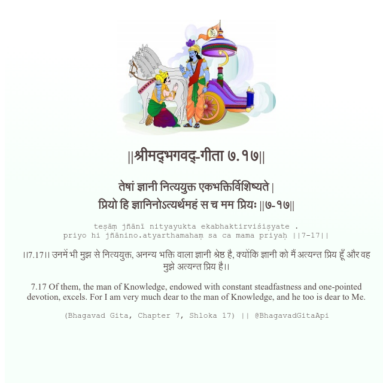

<h2>||श्रीमद्‍भगवद्‍-गीता ७.१७||</h2>
<h3>तेषां ज्ञानी नित्ययुक्त एकभक्तिर्विशिष्यते | प्रियो हि ज्ञानिनोऽत्यर्थमहं स च मम प्रियः ||७-१७||</h3>
<pre>teṣāṃ jñānī nityayukta ekabhaktirviśiṣyate . priyo hi jñānino.atyarthamahaṃ sa ca mama priyaḥ ||7-17||</pre>

।।7.17।। उनमें भी मुझ से नित्ययुक्त, अनन्य भक्ति वाला ज्ञानी श्रेष्ठ है, क्योंकि ज्ञानी को मैं अत्यन्त प्रिय हूँ और वह मुझे अत्यन्त प्रिय है।।

<pre>(Bhagavad Gita, Chapter 7, Shloka 17) || @BhagavadGitaApi</pre>
https://vedicscriptures.github.io/

#API #bhagavadgitaapi #slok #nodejs #js #api #gitaapi #krishna #hinduism #vedic #ISKCON #shreemadbhagavadgita #technology

