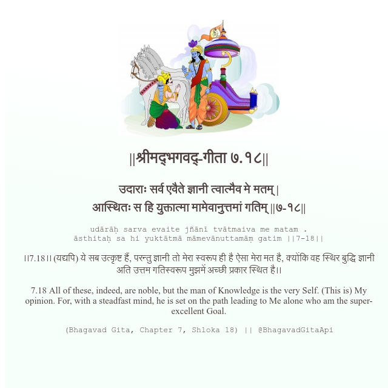

<h2>||श्रीमद्‍भगवद्‍-गीता ७.१८||</h2>
<h3>उदाराः सर्व एवैते ज्ञानी त्वात्मैव मे मतम् | आस्थितः स हि युक्तात्मा मामेवानुत्तमां गतिम् ||७-१८||</h3>
<pre>udārāḥ sarva evaite jñānī tvātmaiva me matam . āsthitaḥ sa hi yuktātmā māmevānuttamāṃ gatim ||7-18||</pre>

।।7.18।। (यद्यपि) ये सब उत्कृष्ट हैं, परन्तु ज्ञानी तो मेरा स्वरूप ही है ऐसा मेरा मत है, क्योंकि वह स्थिर बुद्धि ज्ञानी अति उत्तम गतिस्वरूप मुझमें अच्छी प्रकार स्थित है।।

<pre>(Bhagavad Gita, Chapter 7, Shloka 18) || @BhagavadGitaApi</pre>
https://docs.bhagavadgitaapi.in/

#API #bhagavadgitaapi #slok #nodejs #js #api #gitaapi #krishna #hinduism #vedic #ISKCON #shreemadbhagavadgita #technology

