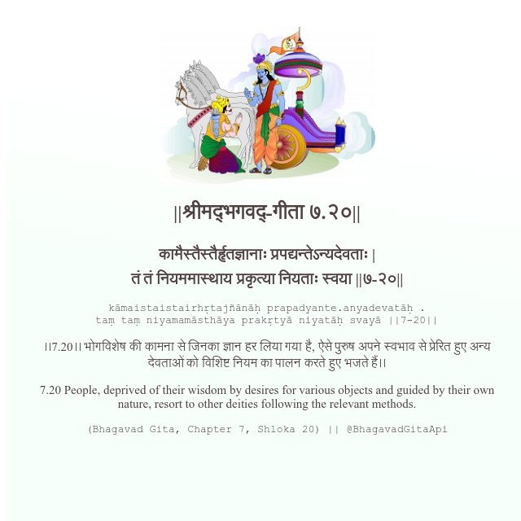

<h2>||श्रीमद्‍भगवद्‍-गीता ७.२०||</h2>
<h3>कामैस्तैस्तैर्हृतज्ञानाः प्रपद्यन्तेऽन्यदेवताः | तं तं नियममास्थाय प्रकृत्या नियताः स्वया ||७-२०||</h3>
<pre>kāmaistaistairhṛtajñānāḥ prapadyante.anyadevatāḥ . taṃ taṃ niyamamāsthāya prakṛtyā niyatāḥ svayā ||7-20||</pre>

।।7.20।। भोगविशेष की कामना से जिनका ज्ञान हर लिया गया है, ऐसे पुरुष अपने स्वभाव से प्रेरित हुए अन्य देवताओं को विशिष्ट नियम का पालन करते हुए भजते हैं।।

<pre>(Bhagavad Gita, Chapter 7, Shloka 20) || @BhagavadGitaApi</pre>
https://bhagavadgitaapi.in/

#API #bhagavadgitaapi #slok #nodejs #js #api #gitaapi #krishna #hinduism #vedic #ISKCON #shreemadbhagavadgita #technology

