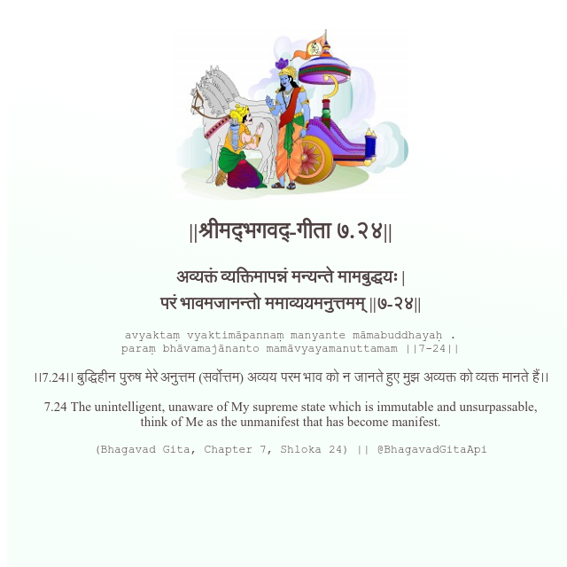

<h2>||श्रीमद्‍भगवद्‍-गीता ७.२४||</h2>
<h3>अव्यक्तं व्यक्तिमापन्नं मन्यन्ते मामबुद्धयः | परं भावमजानन्तो ममाव्ययमनुत्तमम् ||७-२४||</h3>
<pre>avyaktaṃ vyaktimāpannaṃ manyante māmabuddhayaḥ . paraṃ bhāvamajānanto mamāvyayamanuttamam ||7-24||</pre>

।।7.24।। बुद्धिहीन पुरुष मेरे अनुत्तम (सर्वोत्तम) अव्यय परम भाव को न जानते हुए मुझ अव्यक्त को व्यक्त मानते हैं।।

<pre>(Bhagavad Gita, Chapter 7, Shloka 24) || @BhagavadGitaApi</pre>
https://vedicscriptures.github.io/

#API #bhagavadgitaapi #slok #nodejs #js #api #gitaapi #krishna #hinduism #vedic #ISKCON #shreemadbhagavadgita #technology

