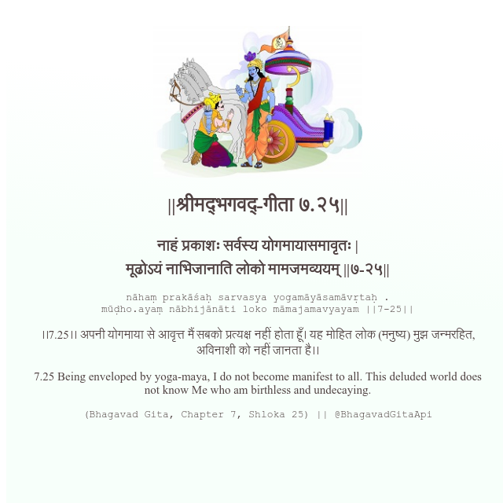

<h2>||श्रीमद्‍भगवद्‍-गीता ७.२५||</h2>
<h3>नाहं प्रकाशः सर्वस्य योगमायासमावृतः | मूढोऽयं नाभिजानाति लोको मामजमव्ययम् ||७-२५||</h3>
<pre>nāhaṃ prakāśaḥ sarvasya yogamāyāsamāvṛtaḥ . mūḍho.ayaṃ nābhijānāti loko māmajamavyayam ||7-25||</pre>

।।7.25।। अपनी योगमाया से आवृत्त मैं सबको प्रत्यक्ष नहीं होता हूँ। यह मोहित लोक (मनुष्य) मुझ जन्मरहित, अविनाशी को नहीं जानता है।।

<pre>(Bhagavad Gita, Chapter 7, Shloka 25) || @BhagavadGitaApi</pre>
https://vedicscriptures.github.io/

#API #bhagavadgitaapi #slok #nodejs #js #api #gitaapi #krishna #hinduism #vedic #ISKCON #shreemadbhagavadgita #technology

