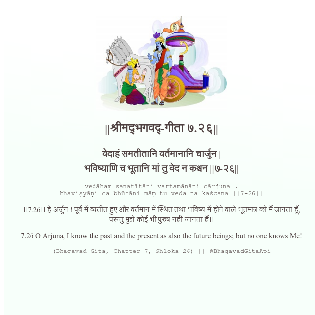

<h2>||श्रीमद्‍भगवद्‍-गीता ७.२६||</h2>
<h3>वेदाहं समतीतानि वर्तमानानि चार्जुन | भविष्याणि च भूतानि मां तु वेद न कश्चन ||७-२६||</h3>
<pre>vedāhaṃ samatītāni vartamānāni cārjuna . bhaviṣyāṇi ca bhūtāni māṃ tu veda na kaścana ||7-26||</pre>

।।7.26।। हे अर्जुन ! पूर्व में व्यतीत हुए और वर्तमान में स्थित तथा भविष्य में होने वाले भूतमात्र को मैं जानता हूँ, परन्तु मुझे कोई भी पुरुष नहीं जानता हैं।।

<pre>(Bhagavad Gita, Chapter 7, Shloka 26) || @BhagavadGitaApi</pre>
https://docs.bhagavadgitaapi.in/

#API #bhagavadgitaapi #slok #nodejs #js #api #gitaapi #krishna #hinduism #vedic #ISKCON #shreemadbhagavadgita #technology

