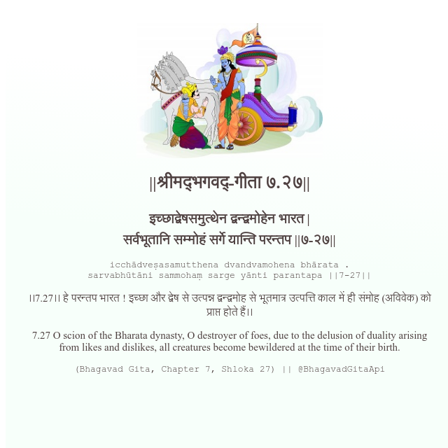

<h2>||श्रीमद्‍भगवद्‍-गीता ७.२७||</h2>
<h3>इच्छाद्वेषसमुत्थेन द्वन्द्वमोहेन भारत | सर्वभूतानि सम्मोहं सर्गे यान्ति परन्तप ||७-२७||</h3>
<pre>icchādveṣasamutthena dvandvamohena bhārata . sarvabhūtāni sammohaṃ sarge yānti parantapa ||7-27||</pre>

।।7.27।। हे परन्तप भारत ! इच्छा और द्वेष से उत्पन्न द्वन्द्वमोह से भूतमात्र उत्पत्ति काल में ही संमोह (अविवेक) को प्राप्त होते हैं।।

<pre>(Bhagavad Gita, Chapter 7, Shloka 27) || @BhagavadGitaApi</pre>
https://bhagavadgitaapi.in/

#API #bhagavadgitaapi #slok #nodejs #js #api #gitaapi #krishna #hinduism #vedic #ISKCON #shreemadbhagavadgita #technology

