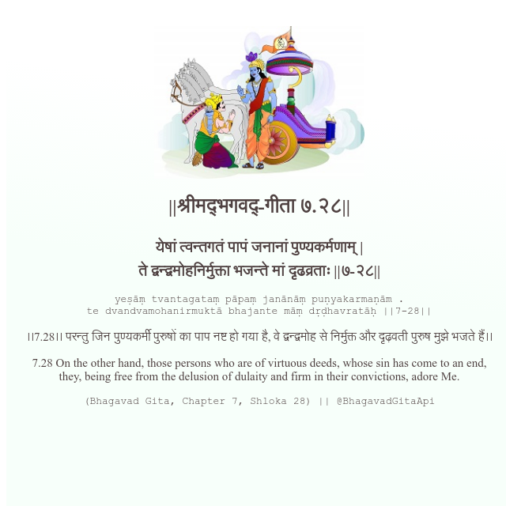

<h2>||श्रीमद्‍भगवद्‍-गीता ७.२८||</h2>
<h3>येषां त्वन्तगतं पापं जनानां पुण्यकर्मणाम् | ते द्वन्द्वमोहनिर्मुक्ता भजन्ते मां दृढव्रताः ||७-२८||</h3>
<pre>yeṣāṃ tvantagataṃ pāpaṃ janānāṃ puṇyakarmaṇām . te dvandvamohanirmuktā bhajante māṃ dṛḍhavratāḥ ||7-28||</pre>

।।7.28।। परन्तु जिन पुण्यकर्मी पुरुषों का पाप नष्ट हो गया है, वे द्वन्द्वमोह से निर्मुक्त और दृढ़वती पुरुष मुझे भजते हैं।।

<pre>(Bhagavad Gita, Chapter 7, Shloka 28) || @BhagavadGitaApi</pre>
https://docs.bhagavadgitaapi.in/

#API #bhagavadgitaapi #slok #nodejs #js #api #gitaapi #krishna #hinduism #vedic #ISKCON #shreemadbhagavadgita #technology

