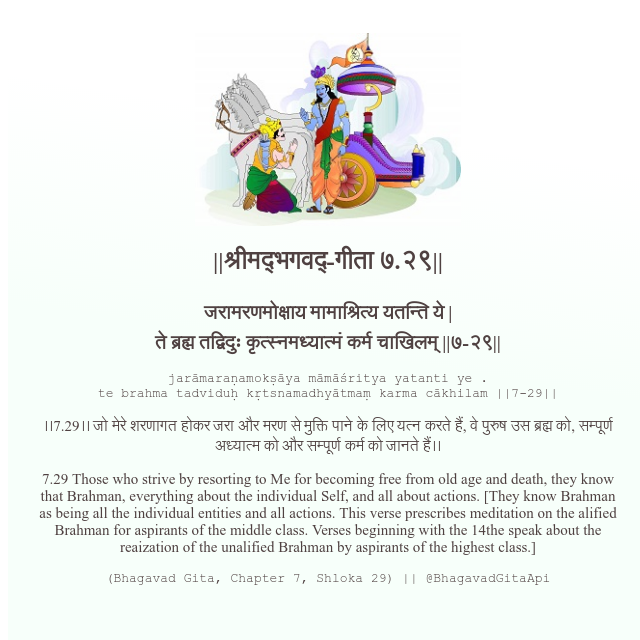

<h2>||श्रीमद्‍भगवद्‍-गीता ७.२९||</h2>
<h3>जरामरणमोक्षाय मामाश्रित्य यतन्ति ये | ते ब्रह्म तद्विदुः कृत्स्नमध्यात्मं कर्म चाखिलम् ||७-२९||</h3>
<pre>jarāmaraṇamokṣāya māmāśritya yatanti ye . te brahma tadviduḥ kṛtsnamadhyātmaṃ karma cākhilam ||7-29||</pre>

।।7.29।। जो मेरे शरणागत होकर जरा और मरण से मुक्ति पाने के लिए यत्न करते हैं, वे पुरुष उस ब्रह्म को, सम्पूर्ण अध्यात्म को और सम्पूर्ण कर्म को जानते हैं।।

<pre>(Bhagavad Gita, Chapter 7, Shloka 29) || @BhagavadGitaApi</pre>
https://vedicscriptures.github.io/

#API #bhagavadgitaapi #slok #nodejs #js #api #gitaapi #krishna #hinduism #vedic #ISKCON #shreemadbhagavadgita #technology

