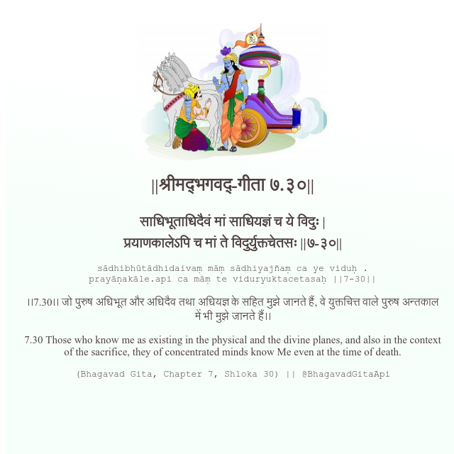

<h2>||श्रीमद्‍भगवद्‍-गीता ७.३०||</h2>
<h3>साधिभूताधिदैवं मां साधियज्ञं च ये विदुः | प्रयाणकालेऽपि च मां ते विदुर्युक्तचेतसः ||७-३०||</h3>
<pre>sādhibhūtādhidaivaṃ māṃ sādhiyajñaṃ ca ye viduḥ . prayāṇakāle.api ca māṃ te viduryuktacetasaḥ ||7-30||</pre>

।।7.30।। जो पुरुष अधिभूत और अधिदैव तथा अधियज्ञ के सहित मुझे जानते हैं, वे युक्तचित्त वाले पुरुष अन्तकाल में भी मुझे जानते हैं।।

<pre>(Bhagavad Gita, Chapter 7, Shloka 30) || @BhagavadGitaApi</pre>
https://bhagavadgitaapi.in/

#API #bhagavadgitaapi #slok #nodejs #js #api #gitaapi #krishna #hinduism #vedic #ISKCON #shreemadbhagavadgita #technology

