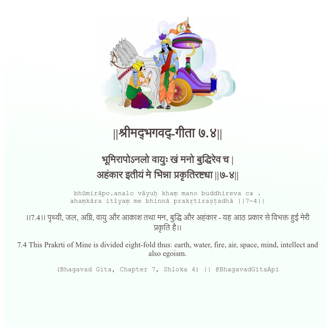

<h2>||श्रीमद्‍भगवद्‍-गीता ७.४||</h2>
<h3>भूमिरापोऽनलो वायुः खं मनो बुद्धिरेव च | अहंकार इतीयं मे भिन्ना प्रकृतिरष्टधा ||७-४||</h3>
<pre>bhūmirāpo.analo vāyuḥ khaṃ mano buddhireva ca . ahaṃkāra itīyaṃ me bhinnā prakṛtiraṣṭadhā ||7-4||</pre>

।।7.4।। पृथ्वी, जल, अग्नि, वायु और आकाश तथा मन, बुद्धि और अहंकार - यह आठ प्रकार से विभक्त हुई मेरी प्रकृति है।।

<pre>(Bhagavad Gita, Chapter 7, Shloka 4) || @BhagavadGitaApi</pre>
https://bhagavadgitaapi.in/

#API #bhagavadgitaapi #slok #nodejs #js #api #gitaapi #krishna #hinduism #vedic #ISKCON #shreemadbhagavadgita #technology

