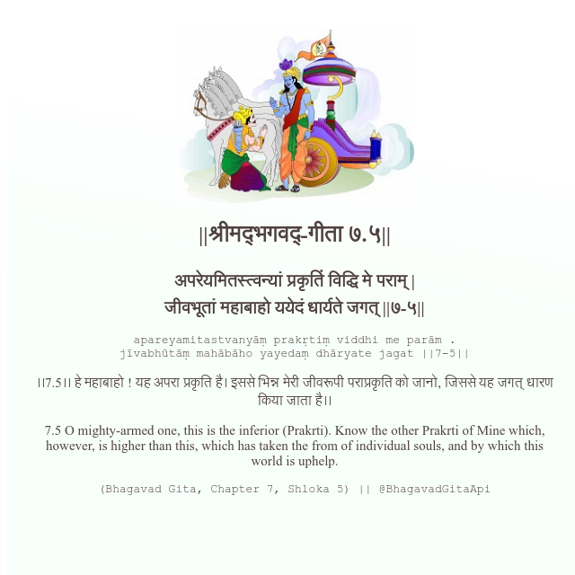

<h2>||श्रीमद्‍भगवद्‍-गीता ७.५||</h2>
<h3>अपरेयमितस्त्वन्यां प्रकृतिं विद्धि मे पराम् | जीवभूतां महाबाहो ययेदं धार्यते जगत् ||७-५||</h3>
<pre>apareyamitastvanyāṃ prakṛtiṃ viddhi me parām . jīvabhūtāṃ mahābāho yayedaṃ dhāryate jagat ||7-5||</pre>

।।7.5।। हे महाबाहो ! यह अपरा प्रकृति है। इससे भिन्न मेरी जीवरूपी पराप्रकृति को जानो, जिससे यह जगत् धारण किया जाता है।।

<pre>(Bhagavad Gita, Chapter 7, Shloka 5) || @BhagavadGitaApi</pre>
https://docs.bhagavadgitaapi.in/

#API #bhagavadgitaapi #slok #nodejs #js #api #gitaapi #krishna #hinduism #vedic #ISKCON #shreemadbhagavadgita #technology

