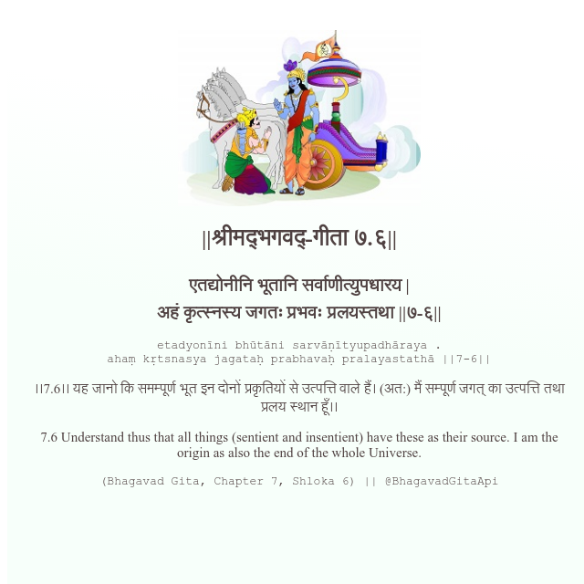

<h2>||श्रीमद्‍भगवद्‍-गीता ७.६||</h2>
<h3>एतद्योनीनि भूतानि सर्वाणीत्युपधारय | अहं कृत्स्नस्य जगतः प्रभवः प्रलयस्तथा ||७-६||</h3>
<pre>etadyonīni bhūtāni sarvāṇītyupadhāraya . ahaṃ kṛtsnasya jagataḥ prabhavaḥ pralayastathā ||7-6||</pre>

।।7.6।। यह जानो कि समम्पूर्ण भूत इन दोनों प्रकृतियों से उत्पत्ति वाले हैं। (अत:) मैं सम्पूर्ण जगत् का उत्पत्ति तथा प्रलय स्थान हूँ।।

<pre>(Bhagavad Gita, Chapter 7, Shloka 6) || @BhagavadGitaApi</pre>
https://docs.bhagavadgitaapi.in/

#API #bhagavadgitaapi #slok #nodejs #js #api #gitaapi #krishna #hinduism #vedic #ISKCON #shreemadbhagavadgita #technology

