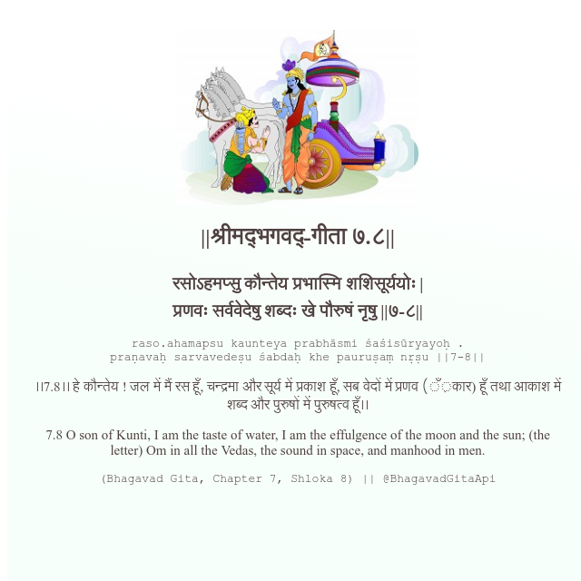

<h2>||श्रीमद्‍भगवद्‍-गीता ७.८||</h2>
<h3>रसोऽहमप्सु कौन्तेय प्रभास्मि शशिसूर्ययोः | प्रणवः सर्ववेदेषु शब्दः खे पौरुषं नृषु ||७-८||</h3>
<pre>raso.ahamapsu kaunteya prabhāsmi śaśisūryayoḥ . praṇavaḥ sarvavedeṣu śabdaḥ khe pauruṣaṃ nṛṣu ||7-8||</pre>

।।7.8।। हे कौन्तेय ! जल में मैं रस हूँ, चन्द्रमा और सूर्य में प्रकाश हूँ, सब वेदों में प्रणव (ँ़कार) हूँ तथा आकाश में शब्द और पुरुषों में पुरुषत्व हूँ।।

<pre>(Bhagavad Gita, Chapter 7, Shloka 8) || @BhagavadGitaApi</pre>
https://vedicscriptures.github.io/

#API #bhagavadgitaapi #slok #nodejs #js #api #gitaapi #krishna #hinduism #vedic #ISKCON #shreemadbhagavadgita #technology

