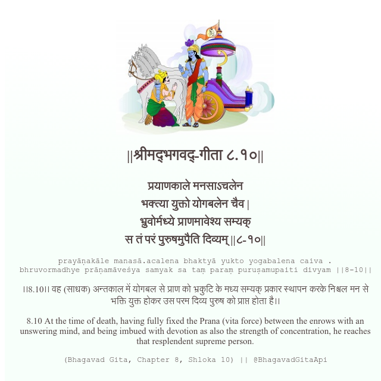

<h2>||श्रीमद्‍भगवद्‍-गीता ८.१०||</h2>
<h3>प्रयाणकाले मनसाऽचलेन भक्त्या युक्तो योगबलेन चैव | भ्रुवोर्मध्ये प्राणमावेश्य सम्यक् स तं परं पुरुषमुपैति दिव्यम् ||८-१०||</h3>
<pre>prayāṇakāle manasā.acalena bhaktyā yukto yogabalena caiva . bhruvormadhye prāṇamāveśya samyak sa taṃ paraṃ puruṣamupaiti divyam ||8-10||</pre>

।।8.10।। वह (साधक) अन्तकाल में योगबल से प्राण को भ्रकुटि के मध्य सम्यक् प्रकार स्थापन करके निश्चल मन से भक्ति युक्त होकर उस परम दिव्य पुरुष को प्राप्त होता है।।

<pre>(Bhagavad Gita, Chapter 8, Shloka 10) || @BhagavadGitaApi</pre>
https://bhagavadgitaapi.in/

#API #bhagavadgitaapi #slok #nodejs #js #api #gitaapi #krishna #hinduism #vedic #ISKCON #shreemadbhagavadgita #technology

