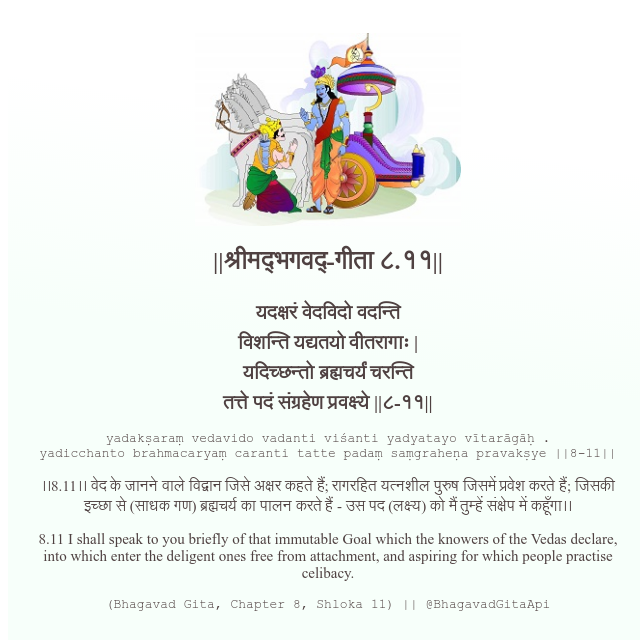

<h2>||श्रीमद्‍भगवद्‍-गीता ८.११||</h2>
<h3>यदक्षरं वेदविदो वदन्ति विशन्ति यद्यतयो वीतरागाः | यदिच्छन्तो ब्रह्मचर्यं चरन्ति तत्ते पदं संग्रहेण प्रवक्ष्ये ||८-११||</h3>
<pre>yadakṣaraṃ vedavido vadanti viśanti yadyatayo vītarāgāḥ . yadicchanto brahmacaryaṃ caranti tatte padaṃ saṃgraheṇa pravakṣye ||8-11||</pre>

।।8.11।। वेद के जानने वाले विद्वान जिसे अक्षर कहते हैं; रागरहित यत्नशील पुरुष जिसमें प्रवेश करते हैं; जिसकी इच्छा से (साधक गण) ब्रह्मचर्य का पालन करते हैं - उस पद (लक्ष्य) को मैं तुम्हें संक्षेप में कहूँगा।।

<pre>(Bhagavad Gita, Chapter 8, Shloka 11) || @BhagavadGitaApi</pre>
https://docs.bhagavadgitaapi.in/

#API #bhagavadgitaapi #slok #nodejs #js #api #gitaapi #krishna #hinduism #vedic #ISKCON #shreemadbhagavadgita #technology

