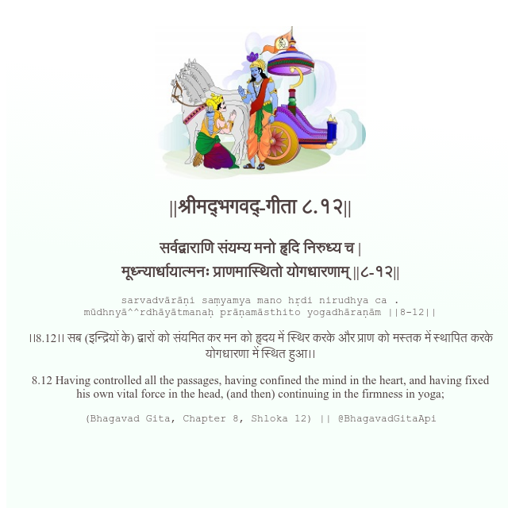

<h2>||श्रीमद्‍भगवद्‍-गीता ८.१२||</h2>
<h3>सर्वद्वाराणि संयम्य मनो हृदि निरुध्य च | मूध्न्यार्धायात्मनः प्राणमास्थितो योगधारणाम् ||८-१२||</h3>
<pre>sarvadvārāṇi saṃyamya mano hṛdi nirudhya ca . mūdhnyā^^rdhāyātmanaḥ prāṇamāsthito yogadhāraṇām ||8-12||</pre>

।।8.12।। सब (इन्द्रियों के) द्वारों को संयमित कर मन को हृदय में स्थिर करके और प्राण को मस्तक में स्थापित करके योगधारणा में स्थित हुआ।।

<pre>(Bhagavad Gita, Chapter 8, Shloka 12) || @BhagavadGitaApi</pre>
https://bhagavadgitaapi.in/

#API #bhagavadgitaapi #slok #nodejs #js #api #gitaapi #krishna #hinduism #vedic #ISKCON #shreemadbhagavadgita #technology

