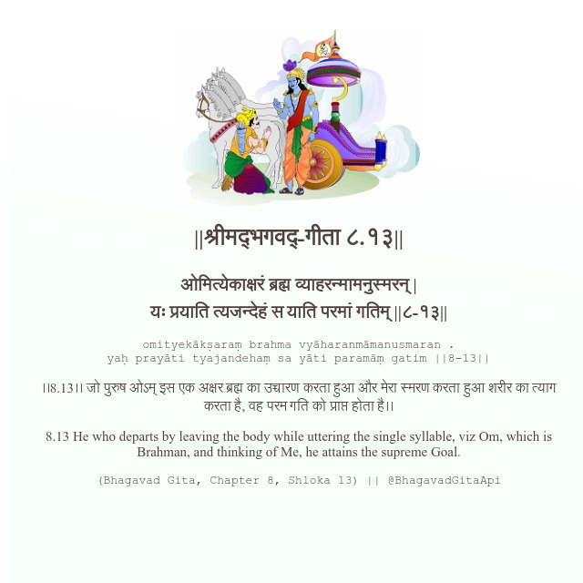

<h2>||श्रीमद्‍भगवद्‍-गीता ८.१३||</h2>
<h3>ओमित्येकाक्षरं ब्रह्म व्याहरन्मामनुस्मरन् | यः प्रयाति त्यजन्देहं स याति परमां गतिम् ||८-१३||</h3>
<pre>omityekākṣaraṃ brahma vyāharanmāmanusmaran . yaḥ prayāti tyajandehaṃ sa yāti paramāṃ gatim ||8-13||</pre>

।।8.13।। जो पुरुष ओऽम् इस एक अक्षर ब्रह्म का उच्चारण करता हुआ और मेरा स्मरण करता हुआ शरीर का त्याग करता है, वह परम गति को प्राप्त होता है।।

<pre>(Bhagavad Gita, Chapter 8, Shloka 13) || @BhagavadGitaApi</pre>
https://bhagavadgitaapi.in/

#API #bhagavadgitaapi #slok #nodejs #js #api #gitaapi #krishna #hinduism #vedic #ISKCON #shreemadbhagavadgita #technology

