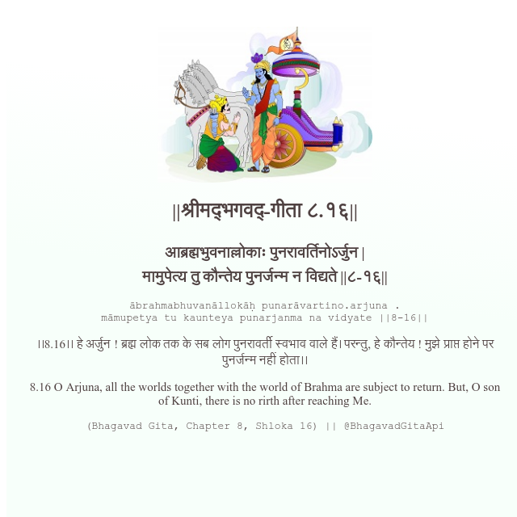

<h2>||श्रीमद्‍भगवद्‍-गीता ८.१६||</h2>
<h3>आब्रह्मभुवनाल्लोकाः पुनरावर्तिनोऽर्जुन | मामुपेत्य तु कौन्तेय पुनर्जन्म न विद्यते ||८-१६||</h3>
<pre>ābrahmabhuvanāllokāḥ punarāvartino.arjuna . māmupetya tu kaunteya punarjanma na vidyate ||8-16||</pre>

।।8.16।। हे अर्जुन ! ब्रह्म लोक तक के सब लोग पुनरावर्ती स्वभाव वाले हैं। परन्तु, हे कौन्तेय ! मुझे प्राप्त होने पर पुनर्जन्म नहीं होता।।

<pre>(Bhagavad Gita, Chapter 8, Shloka 16) || @BhagavadGitaApi</pre>
https://docs.bhagavadgitaapi.in/

#API #bhagavadgitaapi #slok #nodejs #js #api #gitaapi #krishna #hinduism #vedic #ISKCON #shreemadbhagavadgita #technology

